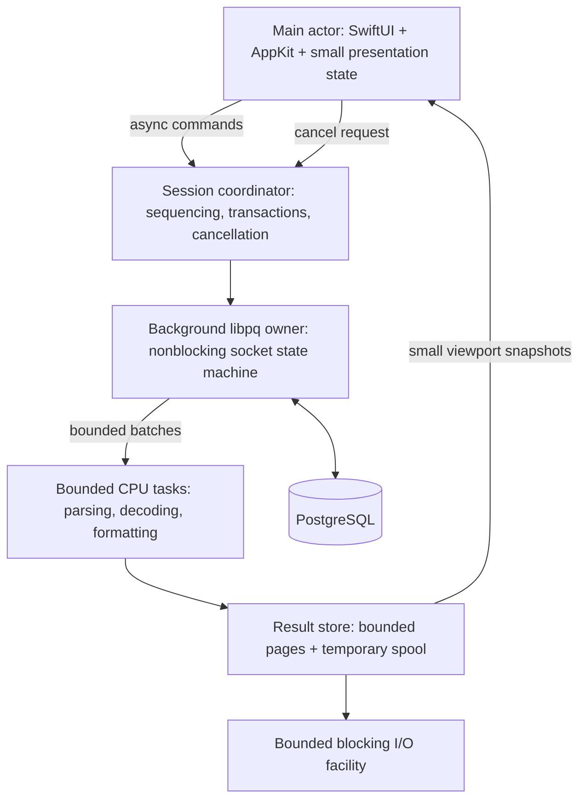

# 01 — Native PostgreSQL workbench scaffold

**Status:** native scaffold implemented; headless verification complete; basic launch/sample-query preview verified; broader interactive acceptance checks pending.  
**Planning date:** 2026-09-29.  
**Confirmed scope:** PostgreSQL only; macOS 26+.  
**Working name:** db3.

## Outcome

Build a Mac database tool that stays responsive while queries execute, results arrive, schemas load, and exports run. Combine Navicat-style database navigation with the worksheet and developer workflow depth associated with Allround Automations' PL/SQL Developer. For db3, procedural-language features mean PostgreSQL's PL/pgSQL; Oracle compatibility is outside scope. [Navicat](https://www.navicat.com/en/products/navicat-premium.html), [PL/SQL Developer](https://www.allroundautomations.com/products/pl-sql-developer/features/).

The first deliverable is a small working vertical slice: connect → edit SQL → execute → inspect streamed rows → cancel → execute again. Schema browsing follows in the next stage. Build this before broad administration features.

“Never locking the main thread” means **no application-controlled blocking I/O or unbounded computation on the main actor**. UI event handling, layout, drawing, and small presentation updates still run there. OS scheduling and framework behavior prevent an absolute zero-hitch guarantee; instrument the contract and enforce measurable budgets. [Apple responsiveness guidance](https://developer.apple.com/documentation/xcode/improving-app-responsiveness).

## Stack options

The performance assessments below are architectural expectations to test, not measured rankings.

| Option | Native macOS UI | Performance and memory considerations | Decision |
| --- | --- | --- | --- |
| SwiftUI shell + AppKit grid/editor | Yes | Native controls; can tightly bound demanding views; bridging needs disciplined ownership | **Recommended starting point** |
| AppKit-heavy app + SwiftUI settings/panels | Yes | Direct control of responder chain, windows, focus, undo, and view lifetimes; more UI plumbing | Strong fallback if workspace complexity warrants it |
| SwiftUI-only | Yes | Convenient state composition; a complex editable grid and IDE editor still need substantial work and validation | Suitable for a smaller viewer; prototype before committing |
| SwiftUI/AppKit + Rust or C++ core | Yes | Can help specific parsing/encoding algorithms; FFI, buffers, cancellation, and packaging add complexity | Add only for a measured bottleneck or valuable existing library |
| Tauri + Rust + web UI | Native window, web content | Uses the system webview on macOS; still introduces a web rendering and message-passing layer | Reconsider only if cross-platform becomes a requirement |
| Electron + web UI | Native window, web content | Chromium's process model and web runtime add a larger architectural baseline | Poor match for these priorities |

Apple supports [AppKit views inside SwiftUI](https://developer.apple.com/documentation/swiftui/nsviewrepresentable). Tauri documents its [system webview](https://v2.tauri.app/reference/webview-versions/), and Electron describes its [Chromium-derived process model](https://www.electronjs.org/docs/latest/tutorial/process-model). Neither a smaller bundle nor a particular language guarantees lower working memory.

Start with Swift and the system frameworks. Avoid adding an ORM, a web editor, a database-neutral plugin layer, or a second language to the scaffold. Keep a narrow PostgreSQL session interface for testing and driver substitution.

### Platform and toolchain

- Deployment target: **macOS 26.0**. This is the agreed minimum, not a claim that it is the newest OS.
- Apple Silicon is the initial performance reference. Intel distribution is an unresolved packaging decision, not a reason to weaken the native design.
- Swift 6 language mode with strict concurrency checking. Require a toolchain supporting Swift 6.2's explicit concurrency controls; pin an appropriate current stable Xcode/SDK when implementation begins.
- Record default actor isolation and upcoming-feature settings per target. UI defaults can be main-actor isolated; core and driver targets must not inherit UI isolation accidentally.
- Commit dependency resolutions and record the compiler, SDK, and native-library versions used for each performance baseline. Check [Apple's Xcode support matrix](https://developer.apple.com/xcode/system-requirements) when pinning them.

## Native interface

Use a SwiftUI workspace shell with a sidebar for connections and schema objects, a central worksheet area, a lower results/messages pane, and an optional inspector. Toolbars expose connection/session state, Run, Cancel, and transaction controls. Native menus and keyboard commands must work through the responder chain; progress must never require a blocking modal dialog.

Use standard sidebars, toolbars, menus, sheets, split views, SF Symbols, semantic colors, and system typography. Both SwiftUI and AppKit participate in Liquid Glass. Keep material effects primarily in navigation/control surfaces; use readable code and table backgrounds and respect Reduce Transparency, Reduce Motion, contrast settings, and VoiceOver. [Apple Liquid Glass overview](https://developer.apple.com/documentation/technologyoverviews/liquid-glass), [materials guidance](https://developer.apple.com/design/human-interface-guidelines/materials).

### Results grid

Start with a reusable, view-based `NSTableView` wrapped in `NSViewRepresentable`. Retain the table and its coordinator across SwiftUI updates. Data-source callbacks return cached presentation values or placeholders immediately; page misses schedule asynchronous work. They never query PostgreSQL, read spool files, wait on a lock, or synchronously call an actor.

Use fixed row heights initially, user-resizable columns, bounded width sampling, targeted updates, and stable row identities within a result. Avoid a SwiftUI view or observable object per cell. Measure horizontal scrolling with hundreds of columns: row reuse alone does not establish that a very wide table meets the budget. If needed, add a visible-column window or a specialized grid behind the same presentation interface. [NSTableView](https://developer.apple.com/documentation/appkit/nstableview).

### SQL editor

Start with `NSTextView` and TextKit 2. Keep native selection, undo, find, input methods, accessibility, and clipboard behavior. Parse changed ranges in background tasks; apply bounded highlight updates only if the document revision still matches. Never reparse or replace a complete attributed document on every keystroke.

Test very long lines as well as large files. TextKit's viewport-oriented layout helps but does not remove storage, indexing, or syntax-processing costs. Introduce a large-file mode with reduced highlighting and deferred analysis if measurements require it. Prototype completion and gutter behavior before selecting an external editor library. [TextKit](https://developer.apple.com/documentation/appkit/textkit), [TextKit 2 architecture](https://developer.apple.com/videos/play/wwdc2021/10061/).

## PostgreSQL driver decision

**Proposed baseline: a thin Swift wrapper over the official `libpq` client, using its nonblocking APIs.** This is a workbench with arbitrary SQL and stateful sessions; explicit control of results, cancellation, and connection state matters more than minimizing wrapper code.

| Candidate | Advantages | Costs and feasibility gates |
| --- | --- | --- |
| `libpq` through Swift/C interop | Documented asynchronous transport, incremental results, cancellation, and broad PostgreSQL compatibility | Own the readiness/state machine, pointer lifetimes, native-library build, TLS dependencies, and shipping updates |
| PostgresNIO | Swift-native asynchronous interface, row sequence with backpressure, optional connection pooling | Validate early cancellation, transaction recovery, arbitrary/custom types, multiple results, and COPY on the pinned release |

PostgresNIO explicitly supports async iteration with backpressure. Its tracker also contains a reported cancellation/state synchronization limitation. Treat that report as a reason for an integration test, not proof that every later version fails. [PostgresNIO documentation](https://github.com/vapor/postgres-nio), [cancellation issue #570](https://github.com/vapor/postgres-nio/issues/570).

For the baseline wrapper:

1. Use connection start/poll APIs, an explicit connection deadline, and socket readiness notifications off the main queue. Resolve hostnames on a bounded background facility; preserve the hostname for certificate verification when using a resolved address. Connection polling does not automatically eliminate DNS blocking. [Connection control](https://www.postgresql.org/docs/current/libpq-connect.html).
2. Enable nonblocking mode. Use send/flush/consume/busy/get-result operations as a state machine; do not use `PQexec` or invoke `PQgetResult` when it would block. Readiness registration must handle socket changes and avoid writable-socket busy loops. [Asynchronous processing](https://www.postgresql.org/docs/current/libpq-async.html).
3. Enable single-row or supported chunked-result mode immediately after submission. Ordinary asynchronous submission can still accumulate a complete result. Copy only the required owned batch data, then release its `PGresult`. Gate chunk APIs on the bundled client version. [Incremental results](https://www.postgresql.org/docs/current/libpq-single-row-mode.html).
4. Give each connection one serial background owner and a fair per-turn work limit. Use readiness callbacks rather than a blocked OS thread per connection or spin-polling. Raw `PGconn`/`PGresult` pointers never escape that owner or appear in UI models. Do not make pointers casually `@unchecked Sendable`. [libpq threading rules](https://www.postgresql.org/docs/current/libpq-threading.html).
5. Use text format as the initial generic value fallback, preserving column type OIDs, lengths, nullability of each value, and exact bytes/text. Request UTF-8 at connection setup, track `client_encoding` changes from user SQL, and encode/decode SQL, values, and identifiers consistently. Suspend new commands with an explicit error for unsupported encodings rather than silently corrupting text. Distinguish NULL from empty strings; do not convert arbitrary-precision numerics through `Double`. Add binary fast paths only where useful and correct.
6. Package a pinned, reproducible `libpq` build and required libraries. A distributed app must not depend on a Homebrew installation. Verify architecture, signing, install names, TLS roots, notices, and upgrade strategy during the feasibility phase.

The driver comparison must test `SELECT pg_sleep(30)` cancellation **before any row arrives**, a million-row stream with a slow consumer, mixed PostgreSQL types, TLS failure, network loss, and execution after cancellation. Select the driver based on those results; do not maintain two production adapters without a concrete need.

## Execution boundaries



| Boundary | Owns | Must not do |
| --- | --- | --- |
| Main actor | Views, input, selection, small presentation snapshots | I/O, SQL parsing, large sorts, whole-result formatting, synchronous waits |
| Session coordinator actor | Command queue, query IDs, session and transaction state | Treat actor reentrancy as automatic query serialization |
| Driver background owner | libpq objects and protocol progress | Wait for UI consumption while holding a lock; call UI code; eagerly collect all rows |
| CPU tasks | Parsing, decoding, syntax analysis, export encoding | Block on file/socket I/O; create one task per row |
| Result store and I/O facility | Page index, eviction, spool reads/writes, history and settings persistence | Read a file from a table callback; enqueue unlimited work |

`Task {}` from main-actor code can inherit its isolation. Under `NonisolatedNonsendingByDefault`, nonisolated async functions can stay on the caller's actor. Mark CPU entry points explicitly, for example with `@concurrent`, and pass immutable `Sendable` inputs. `nonisolated` on a synchronous function is not an offloading mechanism. [Swift concurrency](https://docs.swift.org/swift-book/documentation/the-swift-programming-language/concurrency/), [SE-0461](https://github.com/swiftlang/swift-evolution/blob/main/proposals/0461-async-function-isolation.md).

Actors isolate state; they are not dedicated blocking threads. Put unavoidable blocking file, credential, or C-library operations on a bounded background queue/worker facility, bridging completion safely into async code. `Task.detached` still uses Swift's cooperative machinery and is not a general solution for blocking APIs. Never use semaphore waits or `DispatchQueue.sync` to turn an async dependency into a UI result. [Apple concurrency performance guidance](https://developer.apple.com/videos/play/wwdc2022/110350/).

Start with at most two concurrent CPU jobs and two blocking I/O jobs, with bounded admission queues; tune after measurement. Prefer scoped child tasks, retain ownership of long-lived tasks, propagate cancellation, and check it between batches. Small UI commits should be coalesced, initially at no more than 20 updates per second during ingestion, with immediate input feedback and final status updates.

## Sessions, cancellation, and correctness

- Open worksheet connections lazily and keep them pinned to that worksheet. Temporary tables, session settings, and transactions must survive between statements. Do not use a generic per-query pool for worksheets.
- Start with a configurable app-wide limit of four worksheet connections and one metadata connection. Queue or explain capacity exhaustion. Never evict a live transaction or silently reconnect and replay SQL. Metadata uses its own short timeout and cannot sit behind a long worksheet query.
- Execute one command at a time on a connection. Maintain an explicit busy state and ordered command queue across actor suspension points. Separate windows/tabs can execute concurrently within the cap.
- Display disconnected, connecting, ready, executing, cancel requested, recovering, and failed states. Track transaction status separately: idle, active transaction, failed transaction, or unknown. Cancellation inside a transaction can require an explicit rollback.
- Route Cancel through a separate `PGcancelConn` using `PQcancelStart`/`PQcancelPoll`, independently of the busy query's result stream; require these APIs in the bundled client. Continue processing the original connection until completion/recovery; a dispatched cancellation request is not a completion acknowledgement. If recovery exceeds its deadline, close the session and report the outcome as uncertain where appropriate. [libpq cancellation](https://www.postgresql.org/docs/current/libpq-cancel.html).
- Associate cancellation with a query generation. Do not start the next query while a late cancellation could affect it. Test races between completion, cancellation, window closure, and reconnection.
- The first slice executes one statement, either the selection or the editor contents, using `PQsendQueryParams` even with zero parameters. That protocol path rejects multiple statements instead of accidentally executing part of a script. Later current-statement detection must handle PostgreSQL quoting, dollar-quoted functions, and comments. Full-script execution through `PQsendQuery` must preserve all result boundaries and PostgreSQL transaction semantics; never split blindly on semicolons. [PostgreSQL protocol flow](https://www.postgresql.org/docs/current/protocol-flow.html).
- Handle `PGRES_COPY_IN`, `PGRES_COPY_OUT`, and `PGRES_COPY_BOTH` from the first slice, even though transfer UI is deferred. An unsupported COPY operation must abort/drain correctly or close the session with a clear status; it must never leave the app claiming the connection is ready while PostgreSQL awaits protocol data.
- Report SQLSTATE, messages, notices, and completion counts without logging passwords or row values. Preserve partially received results as visibly incomplete when execution fails.

## Bounded results and memory

The result store owns data; the observable UI model owns identifiers, counts, selection, status, and viewport snapshots. A million returned rows must not become a million observable objects, dictionaries, attributed strings, or view instances.

Provisional resource limits:

| Resource | Initial policy |
| --- | --- |
| Resident result-page cache | 64 MiB app-wide, not per tab |
| In-flight application result batches | 8 MiB app-wide, with per-query fairness |
| Batch construction | Up to 512 rows or roughly 256 KiB, whichever arrives first; flush partial batches for latency |
| Inactive results | Evict resident pages first; preserve metadata and temporary backing store |
| Temporary spool | Configurable 1 GiB app-wide default quota; pause consumption and offer stop/export/raise-limit on exhaustion |
| Displayed large values | Short previews; explicit full-value inspection; avoid eager JSON parsing or binary expansion |
| Metadata | Lazy expansion, scoped queries, bounded cache and stale-request cancellation |

These application budgets exclude transient driver allocations and editor storage. A single huge PostgreSQL field can exceed a row batch target before the client can inspect it; truncating its displayed text does not fix that allocation. Test oversized fields separately, document the supported envelope, and offer bounded server-side previews in generated table-browsing queries. Do not claim an absolute memory ceiling for arbitrary SQL results.

Use demand-driven consumption with byte accounting. Stop calling for more input when downstream pages/spooling cannot keep up, while preserving cancellation and protocol-recovery progress. An `AsyncSequence` wrapper must actually suspend production at capacity; an unbounded `AsyncStream` or a bounded stream that drops rows is incorrect. Tune libpq read behavior under flood conditions, including its own internal buffers.

Spool result pages incrementally to a private temporary directory, with bounded in-memory indexing and small asynchronous page reads. Use restrictive permissions; delete files when results close and clean orphaned files after a crash. Offer a no-spool mode for sensitive data. Keep query history opt-in/configurable because SQL text may contain secrets. Do not promise secure erasure on SSDs.

Choose text/byte storage with compact offsets initially; benchmark before adding columnar formats. Avoid retaining a large shared buffer through tiny slices, unnecessary Swift copy-on-write copies, and double representations of every cell. Make server-side sort/filter explicit for generated browsing queries. A local sort over fetched rows must be labeled as such; never silently re-execute arbitrary SQL to sort it.

## Scaffold structure

The scaffold uses one Xcode macOS application target and a local Swift package with focused targets. The core structure is implemented.

```text
db3/
  README.md
  Plans/01-scaffold.md
  App/DB3.xcodeproj
  App/DB3App/                 # SwiftUI shell, menus, lifecycle, settings
  Packages/DB3Kit/
    Package.swift
    Sources/DB3Core/          # session commands, states, identifiers, value types
    Sources/DB3Postgres/      # async libpq adapter and connection ownership
    Sources/DB3Results/       # bounded page cache, spool, export pipeline
    Sources/DB3Editor/        # NSTextView bridge, syntax work, editor state
    Sources/DB3Grid/          # NSTableView bridge and presentation cache
    Sources/CLibPQ/           # C module/shim; binary packaging chosen in spike
    Tests/                   # concurrency, adapter, and result-store tests
  Benchmarks/                 # fixtures, harness, recorded results
```

Keep AppKit/SwiftUI imports out of the core, transport, and storage targets. The UI depends on an async session interface and result-page provider; fake implementations can simulate delay, cancellation, malformed values, and failure without a server. A live query exposes metadata, a demand-driven batch source, notices, and a final completion/error, not an eager row array.

Start in one process to reduce lifecycle and IPC complexity. Consider an XPC driver helper only if fault isolation or driver containment becomes a demonstrated requirement; its memory and transfer costs count toward the total budget.

Connection passwords belong in Keychain, with credential access off the main thread. Save connection metadata and workspace state asynchronously using small atomic files initially. Use TLS hostname/certificate validation and explicit connection settings; validate the bundled client's CA strategy. Add a richer local metadata database only when the storage requirements justify it.

## Implementation stages

### 0. Resolve the performance risks

- [x] Pin toolchain and build a distributable `libpq` dependency prototype. Xcode 26.6 / Swift 6.3.3; libpq 17.9 and transitive binary hashes are pinned. Source-reproducible builds remain future packaging work.
- [x] Prove nonblocking connect/query/stream/cancel/recover, multi-statement rejection, and safe unsupported-COPY handling with a headless integration harness.
- [x] Select libpq after the mandatory behavior gates passed; a second production driver is unnecessary.
- [ ] Measure interactive grid scrolling with narrow million-row data and a separate 200-column fixture. Grid and fixtures are implemented; computer-control approval is pending.
- [ ] Measure TextKit 2 with a 1 MiB script and a pathological long-line file. Editor and fixture generator are implemented.
- [ ] Record app startup, idle footprint, allocations, first-page latency, and input responsiveness. A separate driver/store benchmark is recorded in `Benchmarks/`; it does not establish UI acceptance.

**Exit:** driver and UI choices have evidence, packaging is feasible, and any target revisions are documented. No benchmark result is assumed in advance.

### 1. Build the native vertical slice

- [x] Create the app target, local packages, strict concurrency settings, and fake session/result sources.
- [x] Add workspace sidebar, one SQL worksheet, grid, messages, and connection status.
- [x] Add connection profiles, Keychain lookup, TLS settings, lazy connection, and clear failures.
- [x] Execute a single statement from the selection/editor and display streamed result batches with bounded memory.
- [x] Add minimal temporary page spooling, asynchronous page reads, quota handling, and cleanup so evicted result rows remain inspectable. No-spool mode must stop at its limit and mark the result incomplete.
- [x] Implement Cancel, session recovery, transaction status, and clean task/resource shutdown.
- [x] Add signposts and headless tests; bundle all native libraries and verify signature/load paths. A relocated headless binary executes with bundled libraries and no Homebrew library loads.
- [ ] Verify the graphical app on a separate machine without Homebrew; interactive acceptance remains pending.

**Exit:** run a long query and a large result while continuing to type, scroll, switch focus, and cancel; then successfully run another statement in the correct session state.

### 2. Make the workbench useful

- [ ] Lazy `pg_catalog` browser for schemas, tables, views, columns, indexes, and routines.
- [ ] Multiple worksheets/windows with visible session ownership and explicit transaction controls.
- [ ] Incremental highlighting, statement detection, completion from scoped metadata, history, and saved SQL files.
- [ ] Full-script execution with separate result sets, documented transaction behavior, and stop/error handling.
- [ ] Cell inspection, richer spool controls, CSV export with cancellation, and workspace restoration.
- [ ] Explain-plan display; explicitly label `EXPLAIN ANALYZE` as executing the statement before offering it.
- [ ] Editable table browsing only for identifiable base rows, using parameterized writes and conflict handling.

**Exit:** the core query/browse/edit/export workflow meets the agreed performance budgets and preserves transaction correctness.

### Later, after profiling and product validation

PL/pgSQL routine editing, richer explain visualization, schema comparison, COPY-based transfer, SSH tunnels, and debugger integration can be separate plans. PostgreSQL debugging capabilities need their own server/extension research. No other database engines, cross-platform UI, cloud sync, AI assistant, or general plugin framework are included in this scaffold.

## Performance budgets and verification

These are **provisional targets, not measurements or framework guarantees**. Establish the baseline on an Apple Silicon M1-class Mac with 16 GiB RAM, macOS 26+, a Release arm64 build, and a local PostgreSQL server outside the app memory measurement. Record the exact hardware/OS/toolchain. Measure app physical footprint and any app-owned helper processes, not just Swift allocations or bundle size.

| Measurement | Initial acceptance target |
| --- | --- |
| Warm launch to editable worksheet | p95 ≤ 1 second; no network connection on the critical path |
| Cold launch | Record separately; initial target ≤ 2 seconds on the reference machine |
| UI batch commit | p95 < 5 ms; investigate any app-controlled main-thread slice > 50 ms |
| Input-to-visible-update during fetching | p95 < 50 ms, with no sustained scroll/typing stalls |
| Idle footprint | ≤ 120 MiB with one empty worksheet, settled after launch |
| Large-result footprint | ≤ 300 MiB with one active stream, ten worksheet tabs total, and bounded result/spool caches |
| First-page presentation | p95 < 100 ms after the driver has a renderable first batch, excluding server/network wait |
| Cancellation | UI acknowledges within 50 ms; local `pg_sleep` stops and session state settles within 1 second |
| Long-running fetch/export | Memory plateaus with row count; no unbounded tasks, queued batches, or temporary files |

Large-result reference fixture: one million rows, eight scalar/text columns, approximately 256 bytes of payload per row, plus a separate 200-column stress case. Test 1 MiB and larger SQL documents, long lines, large JSON/bytea values, and unknown/custom PostgreSQL types separately; do not hide their costs inside the narrow-row benchmark.

Use Time Profiler, Allocations, memory graphs, Swift Concurrency instrumentation, and signposts around submit, first byte, first batch, UI commit, cancel request, and session recovery. Report distributions, workload, cache state, and server time separately. Start with at least 30 warm-launch and repeated interaction samples; preserve a reproducible harness.

Meaningful checks include cancellation before the first row; late cancellation races; failed-transaction rollback; a slow consumer causing bounded backpressure; dropped network/TLS failure; spool quota/full-disk failure; closing a busy tab; restoring documents without auto-running SQL; and exact preservation of nulls/numerics. Use a disposable local database for integration fixtures.

Headless build, unit/integration tests, file inspection, and CLI profiling do not require desktop control. Under the workspace's user instructions, any future UI automation or computer-control session requires fresh explicit permission immediately before it begins. Following explicit approval, app launch and a 10,000-row sample query were verified through computer control on macOS 26.5.1. Broader interaction/performance checks remain unverified; any later control session requires fresh approval.

## Decisions remaining after this plan

The PostgreSQL-only scope and macOS 26+ minimum are settled. Implementation should resolve the exact stable toolchain, pinned client build, libpq-versus-PostgresNIO gate, distribution channel/sandboxing, Intel packaging, and supported PostgreSQL server-version matrix. Measure the proposed budgets before expanding scope; revise them openly if the reference workloads show a different tradeoff.

## Implementation record

The native scaffold builds in Debug and Release. Sixteen PostgreSQL integration cases and the result-store suite cover protocol recovery, verified TLS, memory/spool quotas, exact values, cleanup, and export. Run `Scripts/test.sh --integration` for the current complete suite; it creates and destroys its own plain/TLS database fixtures. `Scripts/verify-bundle.py` checks the signed bundle without opening it.

The app supports four pinned worksheets in one window, native editing/grid/value inspection, Keychain-backed connections, single-statement execution, transaction controls, cancellation, SQL file open/save, CSV export, and memory-only results. Stage 2's schema browser, completion, full scripts, editable tables, explain display, and restoration are not implemented.

Memory choices are explicit: 16 MiB resident pages per worksheet (64 MiB across four), a shared 1 GiB spool budget that one worksheet may borrow, and a roughly 2 MiB accounted batch envelope. CSV export quotes text, uses unquoted empty fields for SQL NULL, writes incrementally to an adjacent private temporary file, and replaces the destination only on success.

A Release headless sample on M5 / 32 GiB / macOS 26.5.1 streamed and spooled 1,000,000 × 8 rows in 1.735 seconds, with 19.9 MiB peak physical footprint. This is not an M1/UI benchmark or an acceptance claim. See `Benchmarks/2026-09-29-headless-1m.json` and its measurement notes.

### Launch verification

The first graphical launch exposed a DYLD library-validation error: ad-hoc app/library signatures have no Team ID and were incompatible with the scaffold's hardened-runtime setting. Local builds now use ordinary ad-hoc signing; production distribution must sign all embedded code with one Developer ID and enable hardened runtime. Bundle verification rejects the broken ad-hoc-plus-runtime combination. The rebuilt app launched successfully on macOS 26.5.1 and displayed all 10,000 generated sample rows. No operating-system update was required.
