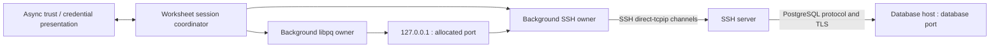

# 03 — SSH tunnels for PostgreSQL connections

**Status:** planned; no SSH transport implemented.  
**Planning date:** 2026-09-29.  
**Depends on:** [01 — scaffold](01-scaffold.md) and the profile/credential model in [02 — import connections](02-import-connections.md).  
**Scope:** native macOS 26+; PostgreSQL through one SSH server; manual and imported connection profiles.

## Outcome

Connect a worksheet to PostgreSQL through SSH without running a separate terminal command. Preserve the database address, credentials, TLS settings, name, and connection color while managing SSH authentication, trust, forwarding, cancellation, and cleanup in db3.

Task 02 provides a menu-driven import wizard: choose a source, initially Navicat Premium Essentials, discover connections, and import all or a selected subset. It preserves SSH configuration and retrievable credentials, but does not establish tunnels. Imported profiles requiring SSH remain visibly unavailable for connection until this task provides a working transport and any unresolved settings are reviewed. Never attempt their database address directly as a fallback.

This document is an implementation plan. It does not import private keys, access passwords, establish network connections, or grant computer-control permission. Keep real connection names, hosts, usernames, paths, passwords, and source files out of repository fixtures and this plan.

## Existing integration points

| Location | Current behavior | Required change |
| --- | --- | --- |
| `Packages/DB3Kit/Sources/DB3Core/DatabaseTypes.swift` | `ConnectionProfile` stores one database endpoint and TLS settings; `DatabaseSession` has async connect, execute, cancel, and disconnect | Add a versioned optional SSH configuration and runtime transport types, coordinated with task 02 |
| `Packages/DB3Kit/Sources/DB3Postgres/PostgresSession.swift` | One serial background owner drives libpq; database DNS is resolved before connect; connect deadline is 15 seconds | Accept an explicit runtime route without rewriting the saved profile or resolving a remote-only database hostname locally |
| Same driver | `PQcancelCreate`/`PQcancelStart`/`PQcancelPoll` use another connection; recovery deadline is 10 seconds | Keep forwarding alive for the original and cancellation connections until recovery finishes |
| `App/DB3App/LocalPersistence.swift` | Metadata is JSON; database password is a Keychain item under the profile UUID; blocking access uses a utility queue | Reuse task 02's credential abstraction for separate database-password, SSH-password, and key-passphrase references |
| `App/DB3App/Worksheet.swift` | Each worksheet owns one session; operation IDs and generation checks fence stale results | Create the appropriate session through a factory; include tunnel setup and shutdown in the same operation lifetime |
| `App/DB3App/ConnectionSheet.swift`, `WorkbenchModel.swift` | Manual/URL entry, saved profiles, and connect orchestration | Add SSH settings, async challenges, validation, and stage-specific connection status |
| `Packages/DB3Kit/Tests/DB3CoreTests/PostgresTests.swift` | Headless connection, cancellation, transaction, and disconnect coverage | Run equivalent cases through a disposable SSH server |

## Profile and import contract

The inspected Navicat source contains 38 PostgreSQL entries, five with `usetunnel` enabled. Its `ssh_param` dictionary exposes `authtype` (integer), `host`, `port`, `username`, `pkeyfile`, `pkeyfilebookmark` (bytes), `savepassword`, and `usecompression`. These are observations about this source, not a universal Navicat schema. Neither connection names nor a filename containing “tunnel” proves that built-in tunneling is enabled.

Task 02 and task 03 must share one schema, rather than create competing SSH representations:

- Preserve the database host and port as the destination **as reached from the SSH server**. Keep SSH host, SSH port, SSH username, authentication choice, compression preference, and key-file reference separately. A source database host of `localhost` means the SSH server's loopback address when tunneling is enabled.
- Store `.disabled`, `.configured`, or `.needsReview` explicitly; retain only allowlisted, typed, nonsecret unsupported settings in import metadata, never raw source dictionaries or archives. Unknown authentication enum values block connection with a useful explanation. Map `authtype` only after versioned synthetic fixtures establish its semantics; do not infer password versus key authentication from integer order.
- Use the stable db3 profile UUID and a credential-purpose discriminator for secret references. Display names, colors, and endpoints must not be Keychain identities. Task 02 owns repeat-import reconciliation, including the fallback identity needed because the inspected `nsy_id` and `nsy_project_uuid` values are empty.
- Preserve private-key location as metadata. Do not copy private-key bytes into JSON, the repository, or a temporary file. Treat a Navicat bookmark as provenance rather than proof db3 has file access. Resolve availability and obtain a db3-owned file reference through native file selection when necessary; balance security-scoped access for the active lifetime. [Apple security-scoped file access](https://developer.apple.com/documentation/foundation/url/startaccessingsecurityscopedresource()).
- `savepassword` describes source intent; it does not establish that a readable secret exists or identify which credential it represents. Preserve the distinction among absent, inaccessible, not requested, and imported credentials. Task 03 asks for a missing credential only when connecting.
- Older direct profiles decode with tunneling disabled. Unknown future schema versions fail clearly. URL/manual editor switching must preserve SSH settings, provenance, stable IDs, and colors rather than silently replacing the profile with URL fields.

Proposed types are `SSHConfiguration`, `SSHAuthentication`, `CredentialReference`, and a nonpersisted `PostgresRoute`. Exact names can follow task 02's implementation. Neither private-key content nor passwords belong in `Codable` profiles or general-purpose diagnostic descriptions.

## Transport decision and feasibility gates

**Proposed baseline: a thin Swift wrapper over pinned libssh2, with one SSH transport per worksheet session.** The app owns a loopback listener and bridges each accepted database socket to a `direct-tcpip` channel. This gives native host-key and credential interaction, atomic ephemeral-port allocation, and explicit ownership of both the query and cancellation channels. libssh2 exposes host-key bytes and channel forwarding; this is a design choice to validate, not an existing implementation. [Host-key API](https://libssh2.org/libssh2_session_hostkey.html), [TCP forwarding API](https://libssh2.org/libssh2_channel_direct_tcpip_ex.html).

| Candidate | Advantages | Risks and decision |
| --- | --- | --- |
| Bundled libssh2 | Typed host-key handling; native interaction; app-owned sockets; direct channel lifecycle | Adds a native dependency and byte-pump implementation. **Baseline, subject to the spike below.** |
| System `/usr/bin/ssh` via Foundation `Process` | Mature OpenSSH authentication and algorithm support; system-maintained executable | Requires robust GUI askpass IPC, process supervision, bounded output capture, and a safe port/readiness strategy. Fallback if the native-library gates fail. |

Before building the settings UI, prove:

1. A distributable pinned libssh2 build and crypto backend work alongside the bundled libpq libraries without symbol/load conflicts. Record versions, source hashes, licenses, architectures, signing, install names, and update procedure. No Homebrew dependency in the shipped app.
2. Supported modern host keys and encrypted/unencrypted OpenSSH private keys work with the selected backend, including Ed25519 and RSA/SHA-2 fixtures. Agent authentication works when launched as a GUI app, not only from a terminal with an inherited `SSH_AUTH_SOCK`. Reject unavailable methods explicitly; never enable legacy algorithms automatically.
3. Handshake, password/key authentication, channel setup, forwarding, and close can make bounded progress off the main actor. Agent operations and private-key decoding need separate scrutiny: a nonblocking SSH socket does not prove every library API is nonblocking or cancellable. Prove deadlines and cancellation against a stalled agent and slow key decryption; choose a cancellable adapter or bounded helper isolation if required.
4. A native async prompt can suspend setup for host trust, a missing SSH password, or an encrypted-key passphrase and resume the same attempt safely. Collect those values before entering library authentication calls. No semaphore, synchronous UI call, or cooperative-executor blocking to bridge a C callback into SwiftUI.
5. libpq TLS verification and its separate cancellation connection both work through the listener, with remote-only DNS and no direct-network fallback.

Keyboard-interactive/MFA, hardware security keys, certificates, and arbitrary `~/.ssh/config` directives are not assumed to work. Expose unsupported requirements clearly and preserve imported values. Keyboard-interactive callbacks require an explicit resumable or isolated design before adding that mode; do not block a library callback awaiting the main actor. [libssh2 keyboard-interactive API](https://libssh2.org/libssh2_userauth_keyboard_interactive_ex.html).

If the baseline fails, record the evidence and choose OpenSSH before production integration. Its feasibility gate must cover a bundled, signed askpass helper using authenticated local IPC and per-attempt challenge IDs; secrets never enter arguments, environment variables, shell text, logs, or files. Spawn a fixed executable with an argument array, disable unintended config/forwarding/commands, bind only loopback, and supervise foreground process exit. `SSH_ASKPASS_REQUIRE` behavior must be verified on the target macOS version. A chosen local port and a running process do not prove that forwarding is ready; `ExitOnForwardFailure` also does not prove the remote database is reachable. Do not introduce `StrictHostKeyChecking=no`, trust-on-scan, password helper scripts, or silent authentication downgrades to make the fallback pass. [OpenSSH invocation and askpass](https://man.openbsd.org/ssh), [forwarding and host-key configuration](https://man.openbsd.org/ssh_config).

## Authentication and host trust

Use a credential provider and a challenge channel between the session coordinator and main-actor presentation. Challenges carry profile ID, attempt ID, purpose, and bounded display data; replies apply only to that still-active attempt. Cancelling or closing a worksheet invalidates outstanding challenges. A prompt must not capture focus repeatedly or open a blocking application-modal loop.

- Support explicit password, private-key with optional passphrase, and agent modes after their feasibility tests pass. Database and SSH passwords remain distinct. Do not try every stored secret or unrelated agent identity automatically; bound identities and authentication attempts.
- Read Keychain off the main actor. A locked, denied, or missing item produces a recoverable credential state; avoid prompt loops and distinguish user cancellation from invalid credentials. “Remember” writes only the matching db3 credential purpose. Passwords and passphrases exist only for the required operation and must not appear in errors or diagnostics. [Apple Keychain lookup](https://developer.apple.com/documentation/security/secitemcopymatching(_:_:)).
- Identify the SSH server by its configured hostname and port, independently of PostgreSQL TLS identity. Obtain the negotiated host key from the active SSH handshake **before sending authentication secrets**. Validate its algorithm and compare it against a db3-owned trust store. libssh2 distinguishes match, not found, mismatch, and failure; retain those distinctions. [Host and port verification](https://libssh2.org/libssh2_knownhost_checkp.html).
- An unknown key presents hostname, port, algorithm, and SHA-256 fingerprint, with Cancel, Trust Once, and Trust and Save. The user can verify it independently. Trust Once lasts only for that transport. Saving trust uses an atomic private file; a rejected key sends no credentials and does not persist trust.
- A changed key fails closed and shows the previous and received fingerprints. Replacement is a separate explicit trust-management action after verification, never an ordinary reconnect prompt with a preselected acceptance action. A malformed trust store, unsupported host certificate, revoked key, or unverifiable key is an error, not “unknown.” Scope v1 to raw host keys; importing OpenSSH trust files, certificate authorities, and revocation lists requires a separate parser/policy gate.
- Reuse a saved trust decision only for the same host/port identity and validated key. Do not trust a Navicat connection solely because its settings or password were imported. Retain compression preferences only where implemented and tested; show unsupported settings for review rather than silently discarding them.

## Forwarding and PostgreSQL identity

The listener binds `127.0.0.1` with port `0`, retains the bound socket, and reads back the allocated port. Never find a free port by binding, closing, and reusing it. Do not expose wildcard or LAN listeners. Loopback limits network exposure but is not isolation from other processes on the same Mac; enforce bounded admissions and keep database authentication/TLS intact.

Give libpq a runtime route:

| libpq / SSH value | Routed connection |
| --- | --- |
| libpq `host` | Saved PostgreSQL hostname used for certificate verification and SNI; an explicit reviewed TLS-name override may be modeled separately if needed |
| libpq `hostaddr` | `127.0.0.1` |
| libpq `port` | Allocated local listener port |
| SSH connection target | SSH hostname and SSH port |
| SSH channel destination | Original PostgreSQL host and port, resolved from the SSH server |

The saved profile, sidebar, editor, history, and export continue to show the real database destination. Do not save the ephemeral port, change the saved hostname to `localhost`, disable verification, or resolve a remote-only database name on the Mac. libpq supports a network address separate from the hostname needed by `verify-full`; SNI is enabled by default. Verify the intended hostname in an integration fixture rather than relying only on parameter construction. [libpq connection parameters](https://www.postgresql.org/docs/17/libpq-connect.html).

SSH encrypts the client-to-SSH-server leg. Preserve the PostgreSQL TLS policy for the path through to the database, including CA and client-certificate metadata provided by task 02; unsupported TLS settings continue to block connection. A profile whose database host is `localhost` may need an explicit certificate hostname supplied by the user. Never invent that hostname from the SSH server name.

All libssh2 state, socket readiness, channel operations, and C pointer lifetimes belong to one background owner. Handle `LIBSSH2_ERROR_EAGAIN` using the required read/write directions, not a busy retry loop. Maintain fair progress across the query and cancel channels. Bound buffers initially to 256 KiB per direction per channel, with a 4 MiB application forwarding budget; stop reading at capacity and resume on drain. Include library-internal buffers in measured memory results. Handle partial writes, EOF/half-close, backpressure, and channel-open failures. [libssh2 readiness directions](https://libssh2.org/libssh2_session_block_directions.html).

## Lifecycle and cancellation

Use an explicit state machine: `idle → resolvingSSH → handshaking → awaitingTrust → authenticating/awaitingCredential → forwarding → connectingDatabase → connected → closing → closed`, with stage-specific failure and cancellation transitions. Main-actor state is a small snapshot; stale callbacks cannot reopen a closed generation.

1. A session factory returns direct, tunneled, or demo behavior behind `DatabaseSession`. A tunnel coordinator acquires credentials, validates trust, owns a transport lease, and starts libpq only after the listener is ready. Keep database DNS behavior unchanged for direct sessions.
2. Network setup has bounded stage deadlines; user-input waiting is a separate cancellable state with an explicit expiry policy. Start the existing 15-second database deadline when libpq starts, rather than spending it on an SSH trust prompt. Expose the failing stage without leaking credentials.
3. Use one SSH transport per worksheet in v1, including separate leases for worksheets using the same saved profile. Share neither transactions nor tunnel lifetimes. This avoids one worksheet's disconnect or credential edit tearing down another. A later pooled transport needs keys covering server, username, auth identity/version, trust policy, destination, and options, plus reference-counted shutdown; it is outside this task.
4. Allow the extra channel needed by `PQcancelCreate`. Preserve the listener and SSH transport while the driver's query protocol drains and cancel connection completes. Query Cancel must not immediately destroy the tunnel. libpq cancellation reuses connection encryption/verification requirements; a dispatched cancel is not proof that the server cancelled the statement. [libpq cancellation](https://www.postgresql.org/docs/17/libpq-cancel.html).
5. Cancelling during setup stops DNS/admission work where possible, invalidates prompts, closes owned sockets/channels, and settles the connect continuation exactly once. Unavoidable background work must be bounded and its eventual result ignored safely.
6. Explicit disconnect, worksheet close, and app shutdown cancel outstanding work, finish libpq/cancel objects, release the listener/channels, close SSH, and release key-file access. Graceful close has a deadline followed by forced socket teardown. Deinitialization is a fallback, not the normal lifecycle API.
7. Tunnel loss during a query marks results incomplete and the session disconnected; transaction outcome is unknown. Fail pending work and permit an explicit new connection. No automatic reconnection, statement replay, transaction replay, or retry of a possibly committed write. Sleep/wake and network changes follow the same rule when the transport is no longer usable.
8. Editing a saved SSH profile affects future sessions; it does not mutate or restart an active worksheet. Idle keepalive and failure detection are bounded policies with tests, not a mechanism to reconnect silently.

## Native settings and status

Extend the connection sheet with “Connect through SSH,” server, port, username, authentication method, private-key chooser, credential/remember controls, and compression where supported. Show the database destination separately from the SSH server. “Test Connection” uses the same coordinator and trust policy, then disposes its temporary session. Disabling SSH is an explicit edit, never a response to transport failure.

Connection status distinguishes waiting for trust, waiting for credentials, opening SSH, connecting to PostgreSQL, and connected through SSH. Imported rows retain task 02's color and provenance. Required review, unavailable key files, unsupported authentication, and denied credentials expose actionable messages. Changes of authentication method do not accidentally delete unrelated saved database or SSH credentials.

## Implementation stages

### 0. Prove the transport

- [ ] Pin and package libssh2; pass all five feasibility gates above with disposable SSH/PostgreSQL fixtures.
- [ ] Record supported algorithms, key formats, agent discovery, blocking-call behavior, cancellation guarantees, and distribution results.
- [ ] Decide the transport once evidence exists; implement only one production adapter.

### 1. Establish shared types and trust

- [ ] Coordinate the backward-compatible profile schema, source enum mapping, missing-credential states, and purpose-specific Keychain references with task 02.
- [ ] Add trust storage, fingerprint presentation models, explicit unknown/changed/rejected outcomes, and async challenge cancellation.
- [ ] Add `DB3SSH` and the chosen native module/build inputs; keep SwiftUI/AppKit out of the transport target.

### 2. Implement forwarding and session ownership

- [ ] Implement nonblocking SSH/authentication, the retained ephemeral listener, bounded channel forwarding, and teardown.
- [ ] Introduce the runtime libpq route and session factory/coordinator; preserve remote hostname/TLS identity.
- [ ] Integrate the additional cancellation channel, operation-ID fencing, deadlines, and explicit recovery behavior.

### 3. Expose manual and imported connections

- [ ] Add SSH settings, async challenges, test connection, status, and editable review states.
- [ ] Enable task 02's imported tunneled profiles only after validation succeeds; preserve colors and duplicate-import identity.
- [ ] Update docs with supported methods and diagnostic guidance using synthetic examples.

### 4. Verify and release

- [ ] Run unit and disposable-server integration tests, package/sign checks, and bounded-memory/cancellation measurements.
- [ ] Verify native interaction, keyboard navigation, accessibility, prompt cancellation, sleep/wake, and quit behavior. Any computer-control session requires fresh explicit user approval immediately before starting or resuming, as required by the user's AGENTS.md instructions; headless CLI/API tests do not require computer control.
- [ ] Record evidence and remaining limitations before marking the task implemented.

## Verification and acceptance

Use generated fixtures and disposable servers; do not connect to imported real databases for automated acceptance. Add focused tests for:

- Old-profile decoding; missing/unknown SSH enum mapping; SSH-port/database-port distinction; IPv4/IPv6 values; remote-only DNS; unchanged names, colors, IDs, and credentials after save/edit/reimport.
- Password, unencrypted key, encrypted key/passphrase, and agent authentication; wrong credential, locked/denied Keychain, unavailable agent, stalled agent, missing/stale file access, and cancellation at each authentication stage.
- Known host success; unknown key accepted once/saved/rejected; changed key rejection; corrupt trust store; unsupported key/certificate; late prompt responses after close. Assert no credential transmission before host-key acceptance.
- Correct database-hostname verification and SNI over loopback routing; wrong certificate, wrong CA, and TLS-disabled explicit profiles; unreachable remote destination and denied forwarding. Assert no direct connection to the original database address from the Mac.
- `pg_sleep` cancellation before its first row followed by `SELECT 42`; cancellation in a transaction followed by rollback; repeated late cancellation; tunnel loss during a write; incomplete result marking; no reconnect/replay.
- Two worksheets using the same profile: closing, cancelling, or editing one leaves the other intact. Race cancellation with connect completion and worksheet/app shutdown; every continuation settles once and no listener, channel, socket, helper, or security-scoped access survives cleanup.
- Slow consumers, partial writes, channel-open failure, large results, and temporary network stalls. Confirm bounded application buffers, fair cancellation progress, no socket spin loop, and no application-controlled blocking work on the main actor.
- Logs, profile JSON, crash diagnostics, process arguments/environment if applicable, test artifacts, and repository changes contain no passwords, passphrases, private keys, or copied source data.

Acceptance requires a manually created profile and a synthetic Navicat-imported profile to connect through SSH, run, cancel, recover, disconnect, and reopen using the same underlying flow. All authentication modes claimed in the UI must pass their gates. Direct PostgreSQL connections and demo sessions must retain their existing behavior. Imported profiles with unresolved settings must stay visible and editable without becoming connectable by accident.
